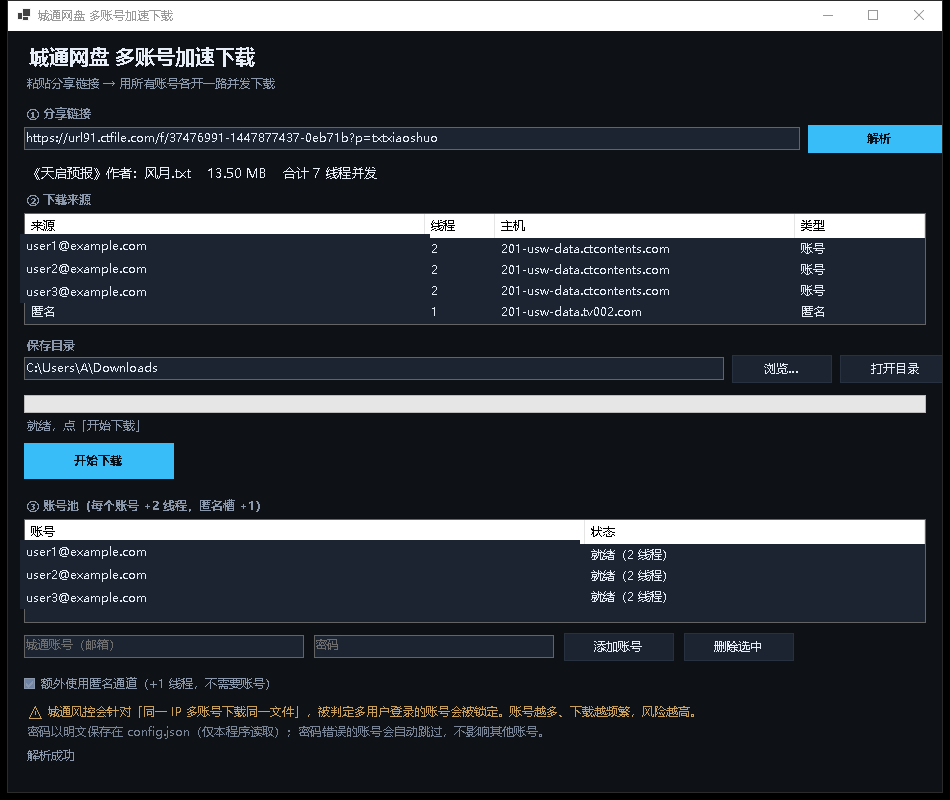

# 城通网盘多账号加速下载器

一个 Windows 桌面工具：把城通网盘（ctfile）的分享链接解析成**真实直链**，并支持**多账号并发下载**。

- 🖥️ 原生 WinForms 界面（单文件 exe，双击即用，不开浏览器）
- ⚡ 多账号并发：每个免费账号提供 2 条并发连接，账号之间**互相叠加**
- 🔓 不需要登录也能用：无账号时自动退回匿名单线程模式
- 🧩 同时提供 Node.js 命令行版，方便脚本化调用
- 📄 完整记录了逆向出来的接口行为 → [docs/API.md](docs/API.md)



> **本项目的由来**：网上流传的 [nekohy/ctfile-downloader](https://github.com/nekohy/ctfile-downloader)
> 依赖的登录接口 `rest.ctfile.com/p2/user/auth/login` 已被城通服务端废弃（一律返回 `410 请升级客户端`），
> 作者演示站域名也已过期，整个项目已经不能用了。
> 本项目重新逆向了城通**当前**的接口（分享页匿名接口 + `api.ctfile.com/v4` 登录 + `rest /p2` 客户端接口），
> 是一套能跑通的新实现。

---

## ⚠️ 免责声明（务必先读）

- 本项目**仅供学习交流与个人使用**，请勿用于任何商业用途。
- 请勿使用本工具下载、传播**无版权 / 违法**的内容。下载他人分享的文件前请确认你有相应权利。
- **多账号并发可能触发城通的风控**，导致账号被锁定（登录返回 `401 多用户登录被锁定`）。
  这是真实发生过的，风险自负。建议只用自己的日常账号，**不要批量注册小号**。
- 本项目与城通网盘官方无任何关系。
- 使用本工具产生的任何后果由使用者自行承担。

---

## 快速开始

### 方式一：直接用编译好的 exe

1. 到 [Releases](../../releases) 下载 `城通网盘下载器.exe`
2. 双击运行（需要 .NET 8 桌面运行时；Win10/11 通常已自带，没有会提示去装）
3. 粘贴分享链接 → 点「解析」→ 点「开始下载」

### 方式二：从源码构建

需要 [.NET 8 SDK](https://dotnet.microsoft.com/download/dotnet/8.0)。

```bash
cd src
dotnet publish -c Release -r win-x64 --self-contained false -p:PublishSingleFile=true -o ../dist
```

产物是 `dist/CtfileDownloader.exe`，改名成 `城通网盘下载器.exe` 即可。

> 想让它在没装 .NET 的机器上也能跑，把 `--self-contained false` 改成 `true`
> （体积从 200KB 变成 100MB+）。

---

## 使用

### 图形界面

```
① 分享链接   粘贴链接 → 点「解析」
             支持 https://url91.ctfile.com/f/xxx?p=提取码
             也支持只填分享码 37476991-1447877437-0eb71b
② 下载       列出每个账号/匿名槽分到的线程数和 CDN 节点
             选保存目录 → 点「开始下载」，有实时进度/速度/剩余时间
③ 账号池     增删账号；勾选框控制是否启用匿名槽
```

小技巧：把分享链接**直接拖到 exe 文件上**，界面会自动打开并开始解析。

### 命令行

exe 自带 CLI 模式，不进界面直接干活：

```bat
城通网盘下载器.exe --cli "https://url91.ctfile.com/f/xxx?p=提取码"
城通网盘下载器.exe --cli "<链接>" --out "D:\存哪" --no-download
```

Node.js 版（需要 Node 18+）：

```bash
cd cli
node resolve.mjs "<链接>"                 # 只解析，直链写进 %TEMP%\ctfile-sources.json
node resolve.mjs "<链接>" --json          # 输出 JSON，方便脚本处理
node 下载.mjs --sources "%TEMP%\ctfile-sources.json" "D:\存哪\文件.mp4"
```

Windows 上也可以直接双击 `cli\解析直链.bat`。

---

## 配置

图形界面里可以增删账号；也可以直接编辑 exe 同目录下的 `config.json`：

```json
{
  "useAnonymous": true,
  "accounts": [
    { "email": "账号1@example.com", "password": "密码1" },
    { "email": "账号2@example.com", "password": "密码2" }
  ]
}
```

- `useAnonymous`：是否额外使用匿名槽（+1 线程，不需要账号）
- **N 个账号 = 2N 线程**，再加匿名 = 2N+1
- 登录失败的账号会**自动跳过**并在结果里提示，不影响其他账号
- ⚠️ **密码是明文存储的**，仅本程序读取。文件不存在或删掉 → 自动退回匿名单线程模式

参考 `config.example.json`。

---

## 实测性能

> 数据来自一台家用 Windows 机器（直连，无代理），下载同一批公开测试文件。

### 多账号 vs 单账号

| 来源 | 线程 | 文件 | 耗时 | 平均速度 |
|---|---|---|---|---|
| 匿名 | 1 | 13.5 MB | — | ~100 KB/s |
| 1 个账号 | 2 | 13.5 MB | 50.2 s | 275 KB/s |
| 2 账号 + 匿名 | 5 | 13.5 MB | 7.9 s | 1.72 MB/s |
| 3 账号 + 匿名 | 7 | 40.6 MB | 380 s | 109 KB/s（慢节点） |

### 速度取决于 CDN 节点

城通把文件分配在哪个存储节点是**服务端决定、客户端无法切换**的（换主机名会直接 503）。
实测两类节点差距明显：

| 节点 | 单连接速度 |
|---|---|
| `201-usw-data.*` | ~104 KB/s（卡在直链里的 `spd=100000`） |
| `89-cucc-data.*` | ~33 KB/s |

多连接**能叠加但非线性**：慢节点上 7 线程聚合约 109 KB/s（约 3.3 倍，不是 7 倍）。

---

## 常见问题

**Q：报错「城通把这个 IP 限流了（HTTP 429）」**

城通的限流是**按接口主机分别计算**的，短时间内请求太多就会触发（比如批量解析了几百个链接）。
工具已经内置 2 秒 / 5 秒两次自动退避重试，仍失败就是这个提示。

处理：等 10~30 分钟自动恢复；或者换个网络（手机热点 / 重启光猫换 IP）立刻解除。

**Q：下载很慢 / 突然变很慢**

先重新点一次「解析」。城通有的节点，账号直链入口会**间歇性整片 503**，这时只剩匿名那条能走（约 33 KB/s）；
等几分钟重新解析，恢复后速度会回到 100 KB/s 以上。工具会在下载前自动预检并跳过不可用的直链。

如果一直很慢，那是文件所在的节点本身慢，客户端无解 —— 只能换时间段再试。

**Q：为什么没有更快的多线程？**

并发数由城通服务端按账号下发（免费账号 `limit=2`）。`fetch_url` 接口不接受任何线程参数
（`thread`/`limit`/`max_thread`/`num` 都试过，一律无效）。想更快只能加账号，或者升级 VIP（VIP 的 `limit` 未验证）。

**Q：账号被锁了怎么办**

返回 `401 多用户登录被锁定` 说明账号被风控判定为多人共用。这个只能联系城通客服，
本工具无法绕过（也不打算做这种事）。**别再拿重要账号去试。**

**Q：支持文件夹分享（`/d/...`）吗**

暂不支持。文件夹分享的接口流程与单文件不同，手里没有有效样本可验证。

**Q：提示「找不到 node」**

只有 `cli\` 下的命令行版才需要 Node.js，图形界面 exe 不需要。

---

## 项目结构

```
├── src/                    C# WinForms 源码
│   ├── Ctfile.cs           接口调用 + 多来源并发下载核心
│   ├── MainForm.cs         界面
│   └── Program.cs          入口（含 --cli 模式）
├── cli/                    Node.js 命令行版
│   ├── core.mjs            核心逻辑（与 exe 共用 config.json）
│   ├── resolve.mjs         解析直链
│   ├── 下载.mjs            多来源并发下载
│   └── 解析直链.bat        双击即用
├── docs/API.md             逆向出来的接口笔记
├── config.example.json     配置示例
└── LICENSE
```

## 工作原理（简述）

```
分享链接
  │
  ├─① GET webapi.ctfile.com/getfile.php     → 拿到 file_id / file_chk / xtredirect
  │
  ├─② 每个账号 POST api.ctfile.com/v4/user/auth/login  → token
  │     ! POST rest.ctfile.com/p2/browser/file/list      xtlink = "ctfile://" + xtredirect
  │     ! POST rest.ctfile.com/p2/browser/file/fetch_url → 带 limit=2 的直链
  │
  ├─③ 匿名兜底 GET webapi.ctfile.com/get_down_url.php    → 带 limit=1 的直链
  │
  └─④ 把所有来源按各自的 limit 展开成 worker 表，
       文件按 worker 总数等分，每段用 HTTP Range 拉取，
       用 RandomAccess.WriteAsync 按偏移直接写进同一个文件（不需要合并临时分片）
```

细节、参数含义、踩过的坑都在 [docs/API.md](docs/API.md)。

## 致谢

- 感谢 [nekohy/ctfile-downloader](https://github.com/nekohy/ctfile-downloader) 提供的思路
- 感谢 [hxz393/CtfileUrlDecoder](https://github.com/hxz393/CtfileUrlDecoder) 等同类项目的经验

## License

[MIT](LICENSE)
